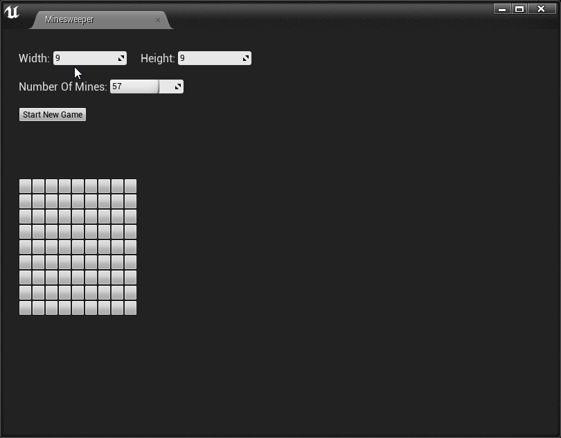
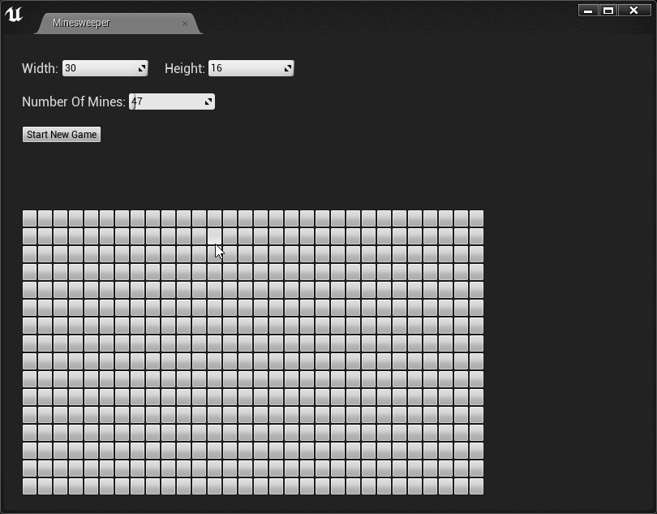

# Minesweeper
A UE4 plugin for player minesweeper game in editor.  
  
This is a learning experience of using Slate to develop editor tools inside Unreal Engine. While still getting used to develop inside Slate, I'm adopting the MVC pattern cause this tool has relatively easy interaction flow. Hence I can draw a clear line between logic and data, and dispatch a full redraw shen update is needed without sacrificing performance.

## Sample GIFs
### Configuring game layout
  
### Win a game
  
### Lose a game
  
